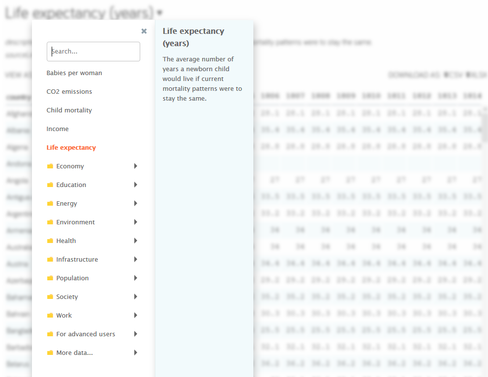

```{r setup, include=FALSE}
knitr::opts_chunk$set(echo = TRUE)
```

# Research question

**We all know the discussion about so called “divided Europe”.**

When the Germans think of Europe, it is mostly about pictures from the western arsenal: the British politeness, French culinary arts, Italian serenity and the Spanish enjoyment of life. However, if you come to talk about the eastern European countries, then post-communist clichés still dominate thinking in this country: dilapidated landscapes, depressed people, grey cities beyond western, light civilization. The Poles, Romanians, Hungarians may geographically belong to the continent, but they are still not recognized as real Europeans. Nevertheless, unlike the French and English, they are perceived as strangers.

Nowadays Eastern European helpers and skilled workers are though not only urgently sought, but also warmly welcomed. But despite this slow approchment, little has changed in the culture of dialogue between East and West: The Germans are aware of developments in France, they travel to Italy, eat Greek food and speak English, but they avoid the quick jump to the east as if a strange world was waiting in Poland, the Czech Republic, Hungary or Bulgaria. Some people say in many heads the iron curtain still exists.

**Sixteen years after the EU east enlargement there are still discussions about a “two-class Europe”. Still, we can find articles about the “grubby kids” from the Eastern Europe and still, there are many prejudices:**

* In Eastern European countries, democracy and its institutions would be undermined.
* The social system is still considered to be expandable more than a quarter of a century after the end of Soviet rule. 
* Crime is higher in Eastern Europe.   
* The gap between rich and poor is wide apart.

**In brief, the former soviet states have still not made it to Europe.**

Sources:

* https://www.zeit.de/kultur/2017-09/osteuropa-klischees-unterentwickelt-rueckstaendig-bundestagswahlkampf
* https://blogs.taz.de/tazlab/2019/04/06/die-schmuddelkinder-aus-osteuropa/
* https://www.mdr.de/nachrichten/osteuropa/politik/estland-tallinn-hammerbeck-russen-100.html
* https://www.piqd.de/europa-eu/die-deutschen-und-osteuropa-ein-fortdauerndes-missverstehen
* https://www.zeit.de/2016/27/vorurteile-osteuropa-ukraine-auslaenderfeindlichkeit/komplettansicht 
* http://www.academiabaltica.de/files/2011-sommerkurs.pdf
* http://www.bpb.de/geschichte/zeitgeschichte/deutsch-polnische-beziehungen/39765/klischees

These prejudices that still exist, led me to some questions:

**1. Are all these prejudices true? Is there really a divided Europe? A two-class Europe, a Europe divided into east and west?** 

**2. If it is true, what are the indicators / factors that make up this division respectively led to this division or maintain it? What are the differences between European countries based on? Are there overriding factors, that is, can we combine sub-factors to a major one? Can we transform variables from higher dimensions into a 1, 2 or 3-dimensional space?**


\


# My approach

## Data
To answer these questions many indicators can be used, e. g. economic factors, socio-economic factors, political factors, indicators about corruption, freedom, … and it is not too easy to decide which indicators to include in the analyzes. First, of course I needed a dataset or, in this case, datasets.

I chose data sets from [Gapminder](https://www.gapminder.org/data/).

> * Gapminder is an independent Swedish foundation with no political, religious or economic affiliations. 
* Gapminder is a fact tank, not a think tank. 
* Gapminder fights devastating misconceptions about global development. 
* Gapminder produces free teaching resources making the world understandable based on reliable statistics. 
* Gapminder promotes a fact-based worldview everyone can understand.  
* Gapminder collaborates with universities, UN, public agencies and non-governmental organizations. 
All Gapminder activities are governed by the board. We do not award grants. Gapminder Foundation is registered at Stockholm County Administration Board. 

Gapminder provides indicators from the following areas:

* Economy
* Education
* Energy
* Environment
* Health
* Infrastructure
* Population
* Society
* Work
* ...



I made my way through all the given indicators, analysed different sets of variables and ended up with the 12 following variables:

* [**Life expectancy**](https://www.gapminder.org/data/documentation/gd004/) - variable: life_expectancy
  + The average number of years a newborn child would live if current mortality patterns were to stay stable.
* [**Human Development Index (HDI)**](https://hdr.undp.org/en) - variable: HDI
  + Human Development Index is an index used to rank countries by level of “human development”. It contains three dimensions: health level, educational level and living standard.
* [**Income per person (GDP/capita, PPP$ inflation-adjusted)**](https://www.gapminder.org/data/documentation/gd001/) - variable: income_person
  + Gross domestic product per person adjusted for difference in purchasing power (in international dollars, fixed 2011 prices, PPP based on 2011 ICP)
* [**Gini coefficient**](https://www.gapminder.org/data/documentation/gini/) - variable: gini_coefficient
  + Gini coefficient shows income inequality in a society. A higher number means more inequality.
* [**Freedom index (FH)**](https://docs.google.com/spreadsheets/d/1AmmTVOAFMXZx3a-OYyKQaNM-dQJAvGCJOwfWzixo2Pk/edit#gid=266682269) - variable: freedom_index
  + Freedom index is the average of political rights and civil liberties ratings and is used to determine countries´ freedom statuses. It´s a range on a scale from 1 (most free) to 7 (least free)
* [**Democracy index (EIU)**](https://docs.google.com/spreadsheets/d/1z-2qkhxth_h4jL__-VjMVIAY8XLSXursWeGqE1r-IHQ/edit#gid=935776888) - variable: democracy_index_eiu population
  + This democracy index is using data from the Economist Inteligence Unit to express the quality of democracies as a number between 0 and 100. It´s based on 60 different aspects of societies that are relevant to democracy universal suffrage for adults, voter participation, perception of human rights protection and freedom to organizations and parties. The democracy index is calculated from the 60 indicators, divided into five “sub indexes”, which are: 1. Electoral pluralism; 2. Government index; 3. Political Participation index; 4. Political culture index; 5. Civil liberty index. The sub-indexes are based on the sum of scores on roughly 12 indicators per sub-index, converted into a score between 0 and 100. (The Economist publishes the index with a scale from 0 to 10, but Gapminder has converted it to 0 to 100 to make it easier to communicate as a percentage.)
* [**Corruption Perception Index (CPI)**](https://www.transparency.org/research/cpi) - variable: CPI
  + Transparency International´s score of perceptions of corruption. Each year Transparency International scores countries on how corrupt their public sectors are seen to be. Their Corruption Perceptions Index sends a powerful message and governments have been forced to take notice and act. Higher values indicate less corruption, that is it ranges on a scale from 0 (highly corrupt) to 100 (very clean).
* [**At least basic water source, overall access (\%)**](https://mdgs.un.org/unsd/mdg/Data.aspx) - variable: basic_water_source
  + The percentage of people using at least basic water services. This indicator encompasses both people using basic water services as well as those using safely managed water services. Basic drinking water services is defined as drinking water from an improved source, provided collection time is not more than 30 minutes for a round trip. Improved water sources include piped water, boreholes (Bohrlöcher) or tubewells (Rohrbrunnen), protected dug wells (Schachtbrunnen), protected springs, and packaged or delivered water.
* [**At least basic sanitation, overall access (\%)**](https://data.worldbank.org/indicator/SH.STA.SMSS.ZS) - variable: basic_sanitation
  + The percentage of people using at least basic sanitation services, that is, improved sanitation facilities that are not shared with other households. This indicator encompasses both people using basic sanitation services as well as those using safely managed sanitation services. Improved sanitation facilities include flush/pour flush sewer systems (Kanalisation, Abwassersystem), septic tanks (Klärgruben) or pit latrines (Grubenlatrine); ventilated improved pit latrines, compositing toilets or pit latrines with slabs.
* [**Food supply (kilocalories / person & day)**](https://www.fao.org/faostat/en/#home) - variable: food_supply
  + Calories measures the energy content of the food. The required intake varies, but is normally in the range of 1500-3000 kilocalories per day. One banana contains approximately 100 kilocalories.
* [**Broadband subscribers (per 100 people)**](https://data.worldbank.org/indicator/IT.NET.BBND.P2) - variable: broadband_subscribers_per_100_people
  + Fixed broadband subscriptions refers to fixed subscriptions to high-speed access to the public Internet (a TCP/IP connection, at downstream speeds equal to, or greater than, 256 kbit/s. This includes cable modem, DSL, fiber-to-the-home/Bulding, other fixed (wired)-broadband subscriptions, satellite broadband and terrestrial fixed wireless broadband. This total is measured ireespective of the method of payment. It excludes subscriptions that have access to data communications (including the Internet) via mobile-cellular networks. It should include fixed WiMAX and any other fixed wireless technologies. It includes both residential subscriptions and subscriptions for organizations.
* [**Individuals using the Internet (% of population)**](https://data.worldbank.org/indicator/IT.NET.USER.ZS) - variable: internet_users

As the data situation is poor for some variables and countries after the year 2015 I used data from this year, even though we are now in 2020. 

## Methods

As outlined in the research question, we want to group countries, look for differences and similarities between countries. This can best be done with **clustering**

To answer the second question and to find out major factors that make up possible differences between European countries, we can use **PCA**. 

The following libraries need to be loaded for my analyzes:

```{r message=FALSE, warning=FALSE}
# Load libraries
library(readxl) # read data
library(tidyverse) # data wrangling and ggplot
library(factoextra) # clustering
library(dendextend) # dendrogram
library(corrplot) # correlation plot
library(GGally) # reduce the complexity of combining geometric objects with transformed data
library(cluster)    # clustering algorithms
library(factoextra) # clustering algorithms & visualization
library(gridExtra) # arrange plots
library(sf) # choropleth map
library(rworldmap) # choropleth map
library(rgeos) # choropleth map
library(viridis) # colors in plots
library(corrplot)
```

# Analysis Part 1 - Clustering

We will follow the steps below to perform k-means clustering using R:

1. Data Preparation: Preparing our data for cluster analysis
2. Clustering Distance Measures: Measuring differences in observations
3. K-Means Clustering: Calculations and methods for creating K subgroups of the data
4. Determining Optimal Clusters: Identifying the right number of clusters to group your data

## 1. Data preparation

Before we can start, we have to load the data:
```{r}
# Load the data
df <- read_excel("country_data12.xlsx")
```

As we only want to analyse European countries we have to filter our dataset. Apart from that we will remove the variables `continent` and `country_continent` because we are only analysing one specific continent:
```{r}
# Filter data for European countries
df <- df %>% filter(continent == "Europe")
df <- df %>%
  select(-country_continent, -continent)
```

To remove any missing value that might be present in the data, we can use `na.omit`:
```{r}
df <- na.omit(df)
```

As Moldova has shown itself to be a major outlier in previous analyzes, we are going to drop this row:
```{r}
drops <- c(25)
df <- df[-drops,]
```

As we don’t want the clustering algorithm to depend to an arbitrary variable unit, we start by scaling/standardizing the data using the R function `scale()`. Before scaling the data, we have to turn the column `country` to rownames because character variables cannot be scaled. Moreover, we will remove the variable `population` because we don´t need it in our cluster analysis:
```{r}
df_cl <- df
df_cl <- df_cl %>% remove_rownames %>% column_to_rownames(var="country")
str(df_cl)

# Standardize the data
df_cl <- df_cl %>%
  select(-population) %>%
  scale()

# Show the first 6 rows
head(df_cl, nrow = 6)

# Show summary to check if all variables are standardized
# summary(df_cl)
```


## 2. (Dis)similarity measures

After the data preparation I calculated the distance matrix and visualized it:

```{r}
# Compute the distance matrix
distance <- get_dist(df_cl, method = "euclidean") # get_dist(): Computes a distance matrix between the rows of a data matrix. Compared to the standard dist() function, it supports correlation-based distance measures including "pearson", "kendall" and "spearman" methods.

# Visualize the distance matrix
fviz_dist(distance, lab_size = 8)
```

**The visualization of the distance matrix already reveals clear differences:**

* We can see a clearly **delimited blue square** in the middle of the bottom. 
  + This implies, for example, that there is a substantial difference between Norway and Albania. 
  + Germany and Albania are also different. 
  + Overall, we can see that there are significant differences between Ireland, Luxembourg, Austria, Belgium, Germany, France, Sweden, Iceland, Denmark, the Netherlands, Norway, Switzerland on the one hand, and Montenegro, Bosnia and Herzegovina, Macedonia, the Ukraine, Turkey, Belarus, Serbia, Albania, Romania and Bulgaria on the other hand. 
* In the middle of the matrix, we can see a **delimited red square**:
  + This indicates, that there are significant similarities between Ireland, Luxembourg, Austria, Belgium, Germany, France, Sweden, Iceland, Denmark, the Netherlands, Norway, Switzerland. These countries seem to have much in common.
* On the right side, the colors are not that intense.

To see easily the **exact distance information** between the countries, we can reformat the results of the function `get_dist()` into a matrix using the `as.matrix()` function. 

The R code below displays the first 6 rows and columns of the distance matrix:
```{r}
as.matrix(distance)[1:6, 1:6]
```

The concrete distance values confirm what we have already seen in the visualization. The distance between Albania and Austria is 8.46, which implies a significant difference; the distance between Austria and Belgium is only 2.6 which means that Austria and Belgium are fairly similar. 

How about the minimum and the maximum distance?
```{r}
min(distance)
max(distance)
```
Germany and United Kingdom are the closest countries (0.80), the greatest distance is between Luxembourg and Ukraine (9.44).

Let´s move on to k-Means clustering now.

## K1. K-Means Clustering

### K-means Algorithm

As outlined in the research question part, we want to find out, if there is a Europe divided into east and west. So, we will first group the data into two clusters (`centers = 2`).

```{r}
k2 <- kmeans(df_cl, centers = 2, nstart = 25)
k2
```

If we print the results, we see that our groupings resulted in 2 cluster sizes of 16 and 23. We also get the cluster assignment for each observation (i.e. Albania was assigned to cluster 2, Austria was assigned to cluster 1, etc.).

We can also see that 45.2 % of the total variance in the data set is explained by the clustering with two clusters. Well, that´s not too good...

Let´s view our results by using `fviz_cluster`. **Note that, if there are more than two dimensions (variables)** `fviz_cluster` will perform **principal component analysis (PCA)** and plot the data points according to the first two principal components that explain the majority of the variance.

```{r}
fviz_cluster(k2, data = df_cl)
```

As we are not too happy with our two cluster solution, we will try out other cluster solutions.

```{r}
k3 <- kmeans(df_cl, centers = 3, nstart = 25)
k4 <- kmeans(df_cl, centers = 4, nstart = 25)
k5 <- kmeans(df_cl, centers = 5, nstart = 25)

# plots to compare
p1 <- fviz_cluster(k2, geom = "point", data = df_cl) + ggtitle("k = 2")
p2 <- fviz_cluster(k3, geom = "point",  data = df_cl) + ggtitle("k = 3")
p3 <- fviz_cluster(k4, geom = "point",  data = df_cl) + ggtitle("k = 4")
p4 <- fviz_cluster(k5, geom = "point",  data = df_cl) + ggtitle("k = 5")

grid.arrange(p1, p2, p3, p4, nrow = 2)
```

Okay, if we choose more than 3 clusters intersections between clusters occur. That does not seem to be optimal.

But what is the optiomal number of clusters?

## K2. Determining Optimal Clusters

As you may recall we as analysts have to specify the number of clusters to use; preferably we would like to use the optimal number of clusters. 

**To aid the analyst, there are methods for determining the optimal clusters. The following are the three most popular methods:**

* Elbow method
* Silhouette method
* Gap statistic

### Elbow Method

Fortunately, the process to compute the “Elbow method” has been wrapped up in a single function (`fviz_nbclust`):
```{r}
set.seed(123)

fviz_nbclust(df_cl, kmeans, method = "wss")
```

**The results suggest that 3 seems the optimal number of clusters as it appears to be the bend in the knee (or elbow).**


### Average Silhouette Method

In short, the average silhouette approach measures the quality of a clustering. That is, it determines how well each object lies within its cluster. A high average silhouette width indicates a good clustering. The average silhouette method computes the average silhouette of observations for different values of k. The optimal number of clusters k is the one that maximizes the average silhouette over a range of possible values for k.

Similar to the elbow method, this process to compute the “average silhoutte method” has been wrapped up in a single function (`fviz_nbclust`):

```{r}
fviz_nbclust(df_cl, kmeans, method = "silhouette")
```

The results show that **2 clusters maximize the average silhouette values** with 3 clusters coming in as second optimal number of clusters.


### Gap Statistic Method

The gap statistic has been published by R. Tibshirani, G. Walther, and T. Hastie (Standford University, 2001). The approach can be applied to any clustering method (i.e. K-means clustering, hierarchical clustering). The gap statistic compares the total intracluster variation for different values of *k* with their expected values under null reference distribution of the data (i.e. a distribution with no obvious clustering). The reference dataset is generated using Monte Carlo simulations of the sampling process. That is, for each variable *(x~i~)* in the data set we compute its range *[min(x~i~),max(x~j~)]* and generate values for the n points uniformly from the interval min to max.

To compute the gap statistic method we can use the `clusGap` function which provides the gap statistic and standard error for an output.

```{r}
# compute gap statistic
set.seed(123)
gap_stat <- clusGap(df_cl, FUN = kmeans, nstart = 25,
                    K.max = 10, B = 50)

# Print the result
print(gap_stat, method = "firstmax")
```

We can visualize the results with `fviz_gap_stat` which suggests 3 clusters as the optimal number of clusters.

```{r}
fviz_gap_stat(gap_stat)
```

## K3. Extracting Results

With two of these approaches suggesting 3 as the number of optimal clusters, we can perform our final analysis and extract the results using 3 clusters.

```{r}
# Compute k-means clustering with k = 3
set.seed(123)
final3 <- kmeans(df_cl, 3, nstart = 25)
#print(final3)
```

Recall that we saw that 45.2 % of the total variance in the data set is explained by the clustering with two clusters. Using 3 clusters we end up with 58.3%. So, grouping the countries into 3 clusters seems to be the better solution.

We can visualize the results in two different ways:

```{r}
fviz_cluster(final3, data = df_cl)

fviz_mclust(final3, data = df_cl)
```


\


## H1. Hierarchical Clustering

### Steps to agglomerative hierarchical clustering

In general, we would have to follow the steps below to perform agglomerative hierarchical clustering using R software:

1. Preparing the data
2. Computing (dis)similarity information between every pair of objects in the data set.
3. Using linkage function to group objects into hierarchical cluster tree, based on the distance information generated at step 2. Objects/clusters that are in close proximity are linked together using the linkage function.
4. Determining where to cut the hierarchical tree into clusters. This creates a partition of the data.

**As we already did the data preparation, we don´t need to do it again. We also computed the dissimilarity matrix using the `get_dist` function. So let's go straight to step 3.**

### Linkage

**There are many cluster agglomeration methods (i.e, linkage methods).** The most common linkage methods are the following:

* **Maximum or complete linkage clustering**: It computes all pairwise dissimilarities between the elements in cluster 1 and the elements in cluster 2, and considers the largest value (i.e., maximum value) of these dissimilarities as the distance between the two clusters. It tends to produce more compact clusters.
* **Minimum or single linkage clustering**: It computes all pairwise dissimilarities between the elements in cluster 1 and the elements in cluster 2, and considers the smallest of these dissimilarities as a linkage criterion. It tends to produce long, “loose” clusters.
* **Mean or average linkage clustering**: It computes all pairwise dissimilarities between the elements in cluster 1 and the elements in cluster 2, and considers the average of these dissimilarities as the distance between the two clusters.
* **Centroid linkage clustering**: It computes the dissimilarity between the centroid for cluster 1 (a mean vector of length p variables) and the centroid for cluster 2.
* **Ward’s minimum variance method**: It minimizes the total within-cluster variance. At each step the pair of clusters with minimum between-cluster distance are merged.

Note that, at each stage of the clustering process the two clusters, that have the smallest linkage distance, are linked together.

**Let´s compare the linkage methods by comparing dendograms that relate on different linkage methods:**

```{r}
complete <-hclust(distance, method = "complete")
single <- hclust(distance, method = "single")
average <- hclust(distance, method = "average")
ward <- hclust(distance, method = "ward.D2")

pcomplete <- fviz_dend(complete, cex = 0.4)
psingle <- fviz_dend(single, cex = 0.4)
paverage <- fviz_dend(average, cex = 0.4)
pward <- fviz_dend(ward, cex = 0.4)

grid.arrange(pcomplete, psingle, paverage, pward, nrow = 2)
```

**We can see that the trees look very different:**

* The complete linkage method has produced a more compact cluster, 
* while the single linkage method has produced long, “loose” clusters. 
* The average linkage has produced a dendogram which is similar to the one of the complete linkage method but the branches are fused at a higher height and you can´t really tell where to cut the tree. 
* This is much easier when looking at the ward linkage method dendogram: we can easily make up 3 clusters. 

**But which cluster tree is the most fitting one? Which linkage method shall we use? And where to cut the tree? Is there a measure that helps us?** Let´s try to verify the cluster tree in the next step.

## H2. Verify the cluster tree

One way to measure how well the cluster tree generated by the `hclust` function reflects your data is to compute the **correlation between the cophenetic distances and the original distance data** generated by the `get_dist` function. If the **clustering is valid**, the linking of objects in the cluster tree should have a **strong correlation** with the distances between objects in the original distance matrix.

**The closer the value of the correlation coefficient is to 1, the more accurately the clustering solution reflects your data. Values above 0.75** are felt to be **good**. 

```{r}
# Compute cophentic distances
complete_coph <- cophenetic(complete)
single_coph <- cophenetic(single)
average_coph <- cophenetic(average)
ward_coph <- cophenetic(ward)

# Correlations between cophenetic distances and
# the original distance
cor(distance, complete_coph)
cor(distance, single_coph)
cor(distance, average_coph)
cor(distance, ward_coph)
```

The correlation coefficients show that the “average” linkage method has produced the highest value (0.81) of this statistic. So following this method we should use the average linkage. But is it really the best one? We saw that it´s really hard to tell where to cut the tree. At long last you would end up with 2 or much more cluster if using the average method. The same applies for the complete linkage method.

However, as all values are nearly or even above 0.75 all clustering solutions accurately reflect our data.

So. let´s cut the dendogram!

### Cut the dendrogram into different groups

As we ended up with 3 as the optimal number of clusters when using kmeans clustering, we will follow the ward-suggestion and cut the tree into 3 groups to find out if the same clusters like in the kmeans clustering are produced:

```{r}
# Cut tree into 3 groups
grp <- cutree(ward, k = 3)
head(grp, n = 10)
```

Let´s have a look at the number of members in each group:
```{r}
# Number of members in each cluster
table(grp)
```
We get the same cluster sizes as with kmeans clustering!

How about the concrete members of each cluster - are they the same as with kmeans? The groups using kmeans clustering ended up with the following countries:


Cluster 1               | Cluster 2               | Cluster 3
------------------------|-------------------------|------------------------
Austria                 | Albania                 | Croatia
Belgium                 | Belarus                 | Cyprus
Denmark                 | Bosnia and Herzegovina  | Czech Republic
Finland                 | Bulgaria                | Estonia
France                  | Macedonia               | Greece
Germany                 | Montenegro              | Hungary
Iceland                 | Romania                 | Italy
Ireland                 | Serbia                  | Latvia
Luxembourg              | Turkey                  | Lithuania
Netherlands             | Ukraine                 | Malta
Norway                  |                         | Poland
Sweden                  |                         | Portugal
Switzerland             |                         | Slovak Republic
United Kingdom          |                         | Slovenia
                        |                         | Spain                            
                                                                                                                                                       

Let´s get the members of the clusters when using hierarchical clustering:
```{r}
# Get the names for the members of cluster 1
rownames(df_cl)[grp == 1]
rownames(df_cl)[grp == 2]
rownames(df_cl)[grp == 3]
```

**That´s kind of an interesting result:**

**The groups are nearly identical if there wasn´t Malta**. While Malta ends up in a cluster with Croatia, Cyprus, Greece etc. when using kmeans, using hierarchical clustering puts Malta in a group with Austria, Belgium, Denmark, Germany etc. 

Again, there is more than one possibility to visualize the clusters:
```{r}
plot(ward, cex = 0.7)
rect.hclust(ward , k = 3, border = 2:6)
abline(h = 10, col = 'purple')
```


```{r}
# library(dendextend)
avg_dend_obj <- as.dendrogram(ward)
avg_col_dend <- color_branches(avg_dend_obj, h = 10)
plot(avg_col_dend, cex = 0.2)
```

## 3. Results
In the beginning I outlined "Is there really a divided Europe? A two-class Europe, a Europe divided into east and west?" as one of my research questions. And the clear answer is: yes and no.

**According to both methods** - k-means clustering and hierarchical clustering - there is no two-class Europe but a **"three-class" Europe**. Both methods suggest 3 as the optimal number of clusters. 

Let´s have a look at the clusters in a choropleth map:

```{r choropleth}
# note: the package sf and the function `geom_sf` allows comfortable working. The advantage if we turn the map object into an object of type `sf`: we can work with the usual ways

world_sf <- st_as_sf(countriesLow) # umwandeln in sf-Objekt

sel_countries <- c("AL", "AT", "BY", "BA", "BG", "MK", "ME", "RO", "RS", "TR", "UA", "AT", "BE", "DK", "FI", "FR", "DE", "IS", "IE", "LU", "MT", "NL", "NO", "SE", "CH", "GB", "HR", "CY", "CZ", "EE", "GR", "HU", "IT", "LV", "LT", "PL", "PT", "SK", "SI", "ES")

world_sf <- world_sf %>% filter(ISO_A2 %in% sel_countries)

# we need a column with the cluster numbers in table 'world_sf'. So we create such a column once in the record 'df':
clust <- c(2, 1, 1, 2, 2, 2, 1, 3, 3, 1, 1, 3, 3, 1, 1, 1, 3, 3, 3, 1, 1, 3, 3, 1, 3, 2, 3, 2, 1, 1, 3, 3, 2, 2, 3, 3, 1, 2, 2)

world_sf <- world_sf %>% mutate(Cluster = clust)
```

```{r warning=FALSE}
# create choropleth map
world_sf %>%
  ggplot() +
  aes(x = ISO_A2, fill = Cluster) +
  geom_sf(alpha = .8) +
  scale_fill_viridis() +
  coord_sf(xlim = c(-20, 40), ylim = c(30, 70)) +
  theme_light() +
  theme(legend.position = "none") +
  labs(title = "Choropleth map",
       x = "",
       fill = paste0("Cluster")) 
```

**Well, there is a certain east-west separation, but there is also some kind of north-south separation:**

* We can make out a certain "North-West" cluster", a kind of "middle-South" cluster and a "East-South" cluster.
* Some countries seem to be somewhere in between the outer clusters. They haven´t made it up to the "North-West" cluster yet or, at some time, might have been member of that cluster but aren´t now. But they are also clearly different from the "East-South" cluster. 

Recall that we visualized the results of the kmeans-clustering by using `fviz_cluster`, and that if there are more than two dimensions (variables) `fviz_cluster` will perform **principal component analysis (PCA)** and plot the data points according to the first two principal components that explain the majority of the variance.

So let´s now do this PCA in detail to find out, which variables make up these two (and possible other) components and how much variance they explain. Let´s answer the questions in what terms the countries in the different clusters differ.


\


# Analysis Part 2 - PCA

## Data preparation
First, we remove not necessary variables and again turn the column country to rownames.

```{r}
# Data preprocessing
df_pca <- df 
df_pca <- df_pca %>% select(-life_expectancy, -population)
df_pca <- df_pca %>% remove_rownames %>% column_to_rownames(var="country")
```

It is usually beneficial for each variable to be centered at zero for PCA, due to the fact that it makes comparing each principal component to the mean straightforward. This also eliminates potential problems with the scale of each variable. For example, the variance of *income* is 295.984.373, while the variance of *HDI* is only 0.00341192 and the on of *Gini* only 15.04447. The *income* data isn’t necessarily more variable, it’s simply on a different scale relative to *HDI* or *Gini*.

```{r}
# compute variance of each variable
apply(df_pca, 2, var)
#as.integer(var)
```

Standardizing each variable will fix this issue. We could do this by using the `scale` function:
```{r}
# create new data frame with centered variables
df_spca <- apply(df_pca, 2, scale)
head(df_spca)
```

But, as there are built-in PCA functions in R, we don´t have to do all the calculating steps...

## Performing PCA
Fortunately R has several built-in functions (along with numerous add-on packages) that simplifies performing PCA. One of these built-in functions is `prcomp`. 

```{r}
pca <- prcomp(df_pca, center = TRUE, scale. = TRUE)
```

### Proportion of Variance
**To make an informed decision, we first apply the summary function on the result in order to look at the proportion of variance explained by the PCs.**

```{r}
summary(pca)
```
It shows the proportion of variance explained by each principle component. In the third row, the cumulative proportion, **we see that the first two PCs  already account for 69% of the total variation in the data.** If we are happy with this number, we can discard the remaining information. 

### Eigenvalues

We can also look at the Eigenvalues to find out how many PCs to retain. If we used the Kaiser-Gutmann-criterion we would keep those PCs with Eigenvalues > 1.
```{r}
get_eigenvalue(pca)
```

Following the KG-criterion we would keep 2 PCs.

### Scree plot
**The most common technique for determining how many principal components to keep is eyeballing the scree plot** which is a visualization of the Eigenvalues. To determine the number of components, we look for the “elbow point”, where the proportion of variance explained significantly drops off.
```{r}
fviz_eig(pca)
```

**Following this approach, we would also keep 2 PCs.**

```{r include=FALSE}
fviz_pca_ind(pca)
```

```{r include=FALSE}
variables <- get_pca_var(pca)
variables$coord
```

```{r include=FALSE}
fviz_pca_var(pca)
```

**To assess the quality of representation of variables more closely, we can use the `corrplot` function.** 

```{r}
corrplot(variables$cos2, is.corr=FALSE)
```

We see that 7 out of eleven variables are well represented by the first principle component, one is acceptably well represented (`basic_water_source`). We also see that the `gini coefficient` is represented in the second principle component. Moreover, we see that `food_supply`, `basic_sanitation`, and `basic_water_source` are (to a certain degree) represented in the third, fourth and fifth PC. Hence, depending on where we cut the data, i.e. depending how strongly we want to reduce dimensions, these informations might be lost.

### Biplot
Finally, we can plot both the countries and the indicators simultaneously in a so called bi-plot. This shows at the same time similarities of countries, correlations of indicators, and the link between countries and indicators:
```{r}
fviz_pca_biplot(pca)
```

The **first principal component** (x-axis) roughly corresponds to **highly developed, democratic countries with high income, a high health and educational level, relatively high living standard and low corruption level**. Countries such as Norway and Luxembourg have high rates, while states such as Albania, the Ukraine and Bosnia and Herzegovina have far lower rates. The **second principal component** (y-axis) is roughly explained as income inequality, which implies that in countries such as Turkey and Romania there is a high income inequality, while in Albania and in the Slovak Republic there is a fairly low income inequality. A country close to the origin, such as Cyprus or Poland, is close to average in both categories.

## Results

Concerning the question, which indicators / factors make up the separation of European countries we now know that there are **two main principle components** which already account for **69% of the total variation** in the data. So, **yes, we can transform the 11 variables into a 2 (or 3)-dimensional space**.

The three clusters differ in terms of (HDI) Human Development Index, income per person, freedom index, democracy index, CPI (Corruption Perception Index), broadband subscribers and internet users on the one hand, and in terms of income inequality on the other hand.

Our **"North-West" cluster** especially has **high values in the first dimension**, whereas our **"East-South" cluster has (very) low values**. The countries of our "middle-South" cluster are all more or less close to the origin and are therefore close to average in both categories.

# Conclusion

## Concerning the Results of my Analysis

According to the results of the cluster analysis, there is no "two-class" Europe but a **“three-class” Europe**.

There is a **certain east-west separation**, but there is also some kind of **north-south separation**:

* We can make out a certain “North-West” cluster“, a kind of ”middle-South" cluster and a “East-South” cluster.
* Some countries seem to be somewhere in between the outer clusters. They haven´t made it up to the “North-West” cluster yet or, at some time, might have been member of that cluster but aren´t at the moment. But they are also clearly different from the “East-South” cluster.

The three **clusters differ in terms of (HDI) Human Development Index, income per person, freedom index, democracy index, CPI (Corruption Perception Index), broadband subscribers and internet users on the one hand, and in terms of income inequality on the other hand**.

\

## Concerning Clustering

### K-means clustering

K-means clustering is a very simple and fast algorithm. Furthermore, it can efficiently deal with very large data sets. However, there are some weaknesses of the k-means approach.

One potential disadvantage of K-means clustering is that it requires us to pre-specify the number of clusters. Hierarchical clustering is an alternative approach which does not require that we commit to a particular choice of clusters. Hierarchical clustering has an added advantage over K-means clustering in that it results in an attractive tree-based representation of the observations, called a dendrogram.

### Hierarchical clustering

Clustering can be a very useful tool for data analysis in the unsupervised setting. However, there are a number of issues that arise in performing clustering. In the case of hierarchical clustering, we need to be concerned about:

* What dissimilarity measure should be used?
* What type of linkage should be used?
* Where should we cut the dendrogram in order to obtain clusters?

Each of these decisions can have a strong impact on the results obtained. In practice, we try several different choices, and look for the one with the most useful or interpretable solution. With these methods, there is no single right answer - any solution that exposes some interesting aspects of the data should be considered.

So, keep in mind that although hierarchical clustering can be performed quickly in R, there are many important variables to consider!

\

Sources: 

* https://www.gapminder.org/data/
* https://stackoverflow.com/questions/5555408/convert-the-values-in-a-column-into-row-names-in-an-existing-data-frame-in-r
* https://www.rdocumentation.org/packages/base/versions/3.6.2/topics/scale
* https://www.rdocumentation.org/packages/GGally/versions/1.4.0
* https://www.rdocumentation.org/packages/psych/versions/1.9.12/topics/cluster.plot
* https://rpkgs.datanovia.com/factoextra/reference/fviz_dend.html
* https://www.r-bloggers.com/hierarchical-clustering-in-r-2/
* https://www.datacamp.com/community/tutorials/hierarchical-clustering-R
