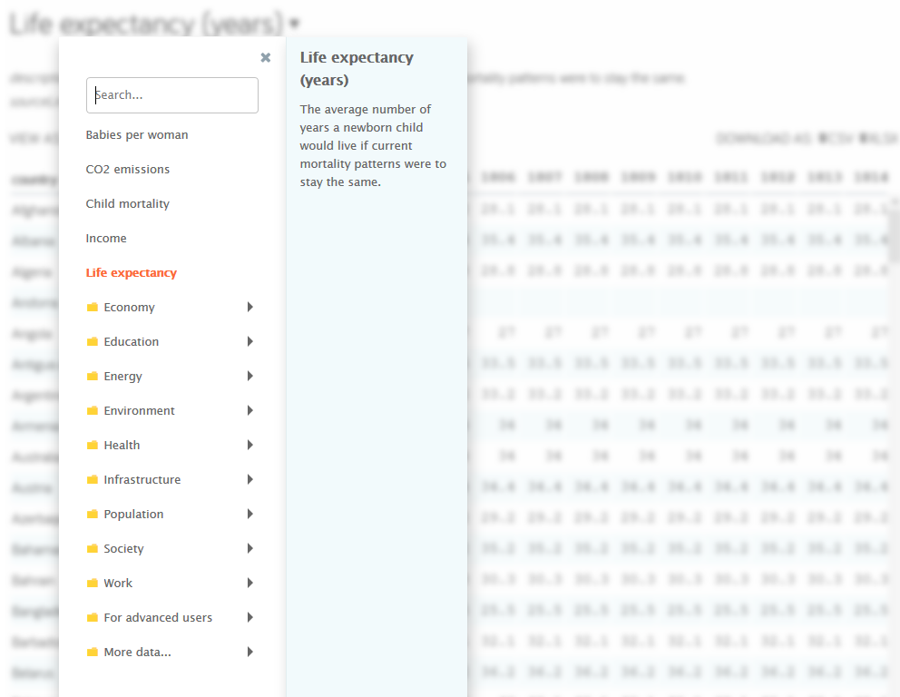

```{r setup, include=FALSE}
knitr::opts_chunk$set(echo = TRUE)
```

# Research question

We all know the discussion about so called “divided Europe”.

When the Germans think of Europe, it is mostly about pictures from the western arsenal: the British politeness, French culinary arts, Italian serenity and the Spanish enjoyment of life. However, if you come to talk about the eastern European countries, then post-communist clichés still dominate thinking in this country: dilapidated landscapes, depressed people, grey cities beyond western, light civilization. The Poles, Romanians, Hungarians may geographically belong to the continent, but they are still not recognized as real Europeans. Nevertheless, unlike the French and English, they are perceived as strangers.

Nowadays Eastern European helpers and skilled workers are though not only urgently sought, but also warmly welcomed. But despite this slow approchment, little has changed in the culture of dialogue between East and West: The Germans are aware of developments in France, they travel to Italy, eat Greek food and speak English, but they avoid the quick jump to the east as if a strange world was waiting in Poland, the Czech Republic, Hungary or Bulgaria. Some people say in many heads the iron curtain still exists.

Sixteen years after the EU east enlargement there are still discussions about a “two-class Europe”. Still, we can find articles about the “grubby kids” from the Eastern Europe and still, there are many prejudices: Crime is higher in Eastern Europe. In Eastern European countries, democracy and its institutions would be undermined. The social system is still considered to be expandable more than a quarter of a century after the end of Soviet rule. The gap between rich and poor is wide apart. In brief, the former soviet states have still not made it to Europe.

Sources:

* https://www.zeit.de/kultur/2017-09/osteuropa-klischees-unterentwickelt-rueckstaendig-bundestagswahlkampf
* https://blogs.taz.de/tazlab/2019/04/06/die-schmuddelkinder-aus-osteuropa/
* https://www.mdr.de/nachrichten/osteuropa/politik/estland-tallinn-hammerbeck-russen-100.html
* https://www.piqd.de/europa-eu/die-deutschen-und-osteuropa-ein-fortdauerndes-missverstehen
* https://www.zeit.de/2016/27/vorurteile-osteuropa-ukraine-auslaenderfeindlichkeit/komplettansicht 
* http://www.academiabaltica.de/files/2011-sommerkurs.pdf
* http://www.bpb.de/geschichte/zeitgeschichte/deutsch-polnische-beziehungen/39765/klischees

These prejudices that still exist, led me to some questions:

**1. Are all these prejudices true? Is there really a divided Europe? A two-class Europe, a Europe divided into east and west?** 

**2. If it is true, what are the indicators / factors that make up this division respectively led to this division or maintain it? What are the differences between European countries based on? Are there overriding factors, that is, can we combine sub-factors to a major one? Can we transform variables from higher dimensions into a 1, 2 or 3-dimensional space?**


\


# My approach

## Data
To answer these questions many indicators can be used, e. g. economic factors, socio-economic factors, political factors, indicators about corruption, freedom, … and it is not too easy to decide which indicators to include in the analyzes. First, of course I needed a dataset or datasets.

I chose data sets from [Gapminder](https://www.gapminder.org/data/).

> * Gapminder is an independent Swedish foundation with no political, religious or economic affiliations. 
* Gapminder is a fact tank, not a think tank. 
* Gapminder fights devastating misconceptions about global development. 
* Gapminder produces free teaching resources making the world understandable based on reliable statistics. 
* Gapminder promotes a fact-based worldview everyone can understand.  
* Gapminder collaborates with universities, UN, public agencies and non-governmental organizations. 
All Gapminder activities are governed by the board. We do not award grants. Gapminder Foundation is registered at Stockholm County Administration Board. 

Gapminder provides indicators from the following areas:

* Economy
* Education
* Energy
* Environment
* Health
* Infrastructure
* Population
* Society
* Work
* ...



I made my way through all the given indicators, analysed different sets of variables and ended up with the 13 following variables:

* [**Life expectancy**](https://www.gapminder.org/data/documentation/gd004/) - variable: life_expectancy
  + The average number of years a newborn child would live if current mortality patterns were to stay stable.
* [**Human Development Index (HDI)**](https://hdr.undp.org/en) - variable: HDI
  + Human Development Index is an index used to rank countries by level of “human development”. It contains three dimensions: health level, educational level and living standard.
* [**Income per person (GDP/capita, PPP$ inflation-adjusted)**](https://www.gapminder.org/data/documentation/gd001/) - variable: income_person
  + Gross domestic product per person adjusted for difference in purchasing power (in international dollars, fixed 2011 prices, PPP based on 2011 ICP)
* [**Gini coefficient**](https://www.gapminder.org/data/documentation/gini/) - variable: gini_coefficient
  + Gini coefficient shows income inequality in a society. A higher number means more inequality.
* [**Freedom index (FH)**](https://docs.google.com/spreadsheets/d/1AmmTVOAFMXZx3a-OYyKQaNM-dQJAvGCJOwfWzixo2Pk/edit#gid=266682269) - variable: freedom_index
  + Freedom index is the average of political rights and civil liberties ratings and is used to determine countries´ freedom statuses. It´s a range on a scale from 1 (most free) to 7 (least free)
* [**Democracy index (EIU)**](https://docs.google.com/spreadsheets/d/1z-2qkhxth_h4jL__-VjMVIAY8XLSXursWeGqE1r-IHQ/edit#gid=935776888) - variable: democracy_index_eiu population
  + This democracy index is using data from the Economist Inteligence Unit to express the quality of democracies as a number between 0 and 100. It´s based on 60 different aspects of societies that are relevant to democracy universal suffrage for adults, voter participation, perception of human rights protection and freedom to organizations and parties. The democracy index is calculated from the 60 indicators, divided into five “sub indexes”, which are: 1. Electoral pluralism; 2. Government index; 3. Political Participation index; 4. Political culture index; 5. Civil liberty index. The sub-indexes are based on the sum of scores on roughly 12 indicators per sub-index, converted into a score between 0 and 100. (The Economist publishes the index with a scale from 0 to 10, but Gapminder has converted it to 0 to 100 to make it easier to communicate as a percentage.)
* [**Corruption Perception Index (CPI)**](https://www.transparency.org/research/cpi) - variable: CPI
  + Transparency International´s score of perceptions of corruption. Each year Transparency International scores countries on how corrupt their public sectors are seen to be. Their Corruption Perceptions Index sends a powerful message and governments have been forced to take notice and act. Higher values indicate less corruption, that is it ranges on a scale from 0 (highly corrupt) to 100 (very clean).
* [**At least basic water source, overall access (\%)**](https://mdgs.un.org/unsd/mdg/Data.aspx) - variable: basic_water_source
  + The percentage of people using at least basic water services. This indicator encompasses both people using basic water services as well as those using safely managed water services. Basic drinking water services is defined as drinking water from an improved source, provided collection time is not more than 30 minutes for a round trip. Improved water sources include piped water, boreholes (Bohrlöcher) or tubewells (Rohrbrunnen), protected dug wells (Schachtbrunnen), protected springs, and packaged or delivered water.
* [**At least basic sanitation, overall access (\%)**](https://data.worldbank.org/indicator/SH.STA.SMSS.ZS) - variable: basic_sanitation
  + The percentage of people using at least basic sanitation services, that is, improved sanitation facilities that are not shared with other households. This indicator encompasses both people using basic sanitation services as well as those using safely managed sanitation services. Improved sanitation facilities include flush/pour flush sewer systems (Kanalisation, Abwassersystem), septic tanks (Klärgruben) or pit latrines (Grubenlatrine); ventilated improved pit latrines, compositing toilets or pit latrines with slabs.
* [**Food supply (kilocalories / person & day)**](https://www.fao.org/faostat/en/#home) - variable: food_supply
  + Calories measures the energy content of the food. The required intake varies, but is normally in the range of 1500-3000 kilocalories per day. One banana contains approximately 100 kilocalories.
* [**Broadband subscribers (per 100 people)**](https://data.worldbank.org/indicator/IT.NET.BBND.P2) - variable: broadband_subscribers_per_100_people
  + Fixed broadband subscriptions refers to fixed subscriptions to high-speed access to the public Internet (a TCP/IP connection, at downstream speeds equal to, or greater than, 256 kbit/s. This includes cable modem, DSL, fiber-to-the-home/Bulding, other fixed (wired)-broadband subscriptions, satellite broadband and terrestrial fixed wireless broadband. This total is measured ireespective of the method of payment. It excludes subscriptions that have access to data communications (including the Internet) via mobile-cellular networks. It should include fixed WiMAX and any other fixed wireless technologies. It includes both residential subscriptions and subscriptions for organizations.
* [**Individuals using the Internet (% of population)**](https://data.worldbank.org/indicator/IT.NET.USER.ZS) - variable: internet_users

As the data situation is poor for some variables and countries after the year 2015 I used data from this year, even though we are now in 2020. 

## Methods

As outlined in the research question, we want to group countries, look for differences and similarities between countries. This can best be done with **clustering**: Clustering is a broad set of techniques for finding subgroups of observations within a data set. When we cluster observations, we want observations in the same group to be similar and observations in different groups to be dissimilar and, that´s exactly what we want.

To answer the second question and to find out major factors that make up possible differences between European countries, we can use **PCA**: PCA reduces the dimensionality of the data set, allowing most of the variability to be explained using fewer variables and, that again, is what we want. 

In the end, **linear regression** is used to analyse what affects life expectancy.

The following libraries need to be loaded for my analyzes:

```{r message=FALSE, warning=FALSE}
# Load libraries
library(readxl) # read data
library(tidyverse) # data wrangling and ggplot
library(factoextra) # clustering
library(dendextend) # dendrogram
library(corrplot) # correlation plot
library(GGally) # reduce the complexity of combining geometric objects with transformed data
library(cluster)    # clustering algorithms
library(factoextra) # clustering algorithms & visualization
library(gridExtra) # arrange plots
library(sf) # choropleth map
library(rworldmap) # choropleth map
library(rgeos) # choropleth map
library(viridis) # colors in plots
library(corrplot)
```

# Analysis Part 1 - Clustering

Clustering is a broad set of techniques for finding subgroups of observations within a data set. When we cluster observations, we want observations in the same group to be similar and observations in different groups to be dissimilar. Because there isn’t a response variable, this is an unsupervised method, which implies that it seeks to find relationships between the n observations without being trained by a response variable. Clustering allows us to identify which observations are alike, and potentially categorize them therein. 

K-means clustering is the simplest and the most commonly used clustering method for splitting a dataset into a set of k groups and so we will start with this method. Afterwards we will compare the results to hierarchical clustering.

We will follow the steps below to perform k-means clustering using R:

1. Data Preparation: Preparing our data for cluster analysis
2. Clustering Distance Measures: Measuring differences in observations
3. K-Means Clustering: Calculations and methods for creating K subgroups of the data
4. Determining Optimal Clusters: Identifying the right number of clusters to group your data

## 1. Data preparation

To perform a cluster analysis in R, generally, the data should be prepared as follows:

1. Rows are observations (individuals) and columns are variables
2. Any missing value in the data must be removed or estimated.
3. The data must be standardized (i.e., scaled) to make variables comparable. Recall that, standardization consists of transforming the variables such that they have mean zero and standard deviation one.

Before we can start, we have to load the data:
```{r}
# Load the data
df <- read_excel("country_data12.xlsx")
```

As we only want to analyse European countries we have to filter our dataset. Apart from that we will remove the variables `continent` and `country_continent` because we are only analysing one specific continent:
```{r}
# Filter data for European countries
df <- df %>% filter(continent == "Europe")
df <- df %>%
  select(-country_continent, -continent)
```

To remove any missing value that might be present in the data, we can use `na.omit`:
```{r}
df <- na.omit(df)
```

As Moldova has shown itself to be a major outlier in previous analyzes, we are going to drop this row:
```{r}
drops <- c(25)
df <- df[-drops,]
```

As we don’t want the clustering algorithm to depend to an arbitrary variable unit, we start by scaling/standardizing the data using the R function `scale()`. Before scaling the data, we have to turn the column `country` to rownames because character variables cannot be scaled. Moreover, we will remove the variable `population` because we don´t need it in our cluster analysis:
```{r}
df_cl <- df
df_cl <- df_cl %>% remove_rownames %>% column_to_rownames(var="country")
str(df_cl)

# Standardize the data
df_cl <- df_cl %>%
  select(-population) %>%
  scale()

# Show the first 6 rows
head(df_cl, nrow = 6)

# Show summary to check if all variables are standardized
# summary(df_cl)
```


## 2. (Dis)similarity measures

The classification of observations into groups requires some methods for computing the distance or the (dis)similarity between each pair of observations. The result of this computation is known as a dissimilarity or distance matrix. There are many methods to calculate this distance information, including Euclidean and manhattan distances. For most common clustering software, the default distance measure is the Euclidean distance. However, depending on the type of the data and the research questions, other dissimilarity measures might be preferred and you should be aware of the options. The choice of distance measures is a critical step in clustering. It defines how the (dis)similarity of two elements (x, y) is calculated and it will influence the shape of the clusters.

Within R it is simple to compute and visualize the distance matrix using the functions `get_dist` and `fviz_dist` from the `factoextra` R package. This starts to illustrate which countries have large dissimilarities (blue) versus those that appear to be fairly similar (red).

* `get_dist`: for computing a distance matrix between the rows of a data matrix. The default distance computed is the Euclidean; however, `get_dist` also supports distanced described in equations 2-5 above plus others.
* `fviz_dist`: for visualizing a distance matrix

```{r}
# Compute the distance matrix
distance <- get_dist(df_cl, method = "euclidean") # get_dist(): Computes a distance matrix between the rows of a data matrix. Compared to the standard dist() function, it supports correlation-based distance measures including "pearson", "kendall" and "spearman" methods.

# Visualize the distance matrix
fviz_dist(distance, lab_size = 8)
```

The visualization of the distance matrix already reveals clear differences:

* We can see a clearly **delimited blue square** in the middle of the bottom. 
  + This implies, for example, that there is a substantial difference between Norway and Albania. 
  + Germany and Albania are also different. 
  + Overall, we can see that there are significant differences between Ireland, Luxembourg, Austria, Belgium, Germany, France, Sweden, Iceland, Denmark, the Netherlands, Norway, Switzerland on the one hand, and Montenegro, Bosnia and Herzegovina, Macedonia, the Ukraine, Turkey, Belarus, Serbia, Albania, Romania and Bulgaria on the other hand. 
* In the middle of the matrix, we can see a **delimited red square**:
  + This indicates, that there are significant similarities between Ireland, Luxembourg, Austria, Belgium, Germany, France, Sweden, Iceland, Denmark, the Netherlands, Norway, Switzerland. These countries seem to have much in common.
* On the right side, the colors are not that intense.

To see easily the **exact distance information** between the countries, we can reformat the results of the function `get_dist()` into a matrix using the `as.matrix()` function. In this matrix, value in the cell formed by the row i, the column j, represents the distance between country i and country j in the original data set. For instance, element 1,1 represents the distance between country 1 and itself (which is zero). Element 1,2 represents the distance between country 1 and country 2, and so on.

The R code below displays the first 6 rows and columns of the distance matrix:
```{r}
as.matrix(distance)[1:6, 1:6]
```

The concrete distance values confirm what we have already seen in the visualization. The distance between Albania and Austria is 8.46, which implies a significant difference; the distance between Austria and Belgium is only 2.6 which means that Austria and Belgium are fairly similar. 

How about the minimum and the maximum distance?
```{r}
min(distance)
max(distance)
```
Germany and United Kingdom are the closest countries (0.80), the greatest distance is between Luxembourg and Ukraine (9.44).

Let´s move on to k-Means clustering now.

## K1. K-Means Clustering

### K-means Algorithm

K-means algorithm can be summarized as follows:

1. specify the number of clusters (K) to be created (by the analyst)
2. Select randomly k objects from the data set as the initial cluster centers or means
3. Assigns each observation to their closest centroid, based on the Euclidean distance between the object and the centroid
4. For each of the k clusters update the cluster centroid by calculating the new mean values of all the data points in the cluster. The centroid of a Kth cluster is a vector of length p containing the means of all variables for the observations in the kth cluster; p is the number of variables.
5. Iteratively minimize the total within sum of square. That is, iterate steps 3 and 4 until the cluster assignments stop changing or the maximum number of iterations is reached. By default, the R software uses 10 as the default value for the maximum number of iterations.

### Computing k-means clustering in R

We can compute k-means in R with the `kmeans` function. 

As outlined in the research question part, we want to find out, if there is a Europe divided into east and west. 
So, we will first group the data into two clusters (`centers = 2`). The `kmeans` function also has an `nstart` option that attempts multiple initial configurations and reports on the best one. For example, adding `nstart = 25` will generate 25 initial configurations. This approach is often recommended and we will use it in this case.

```{r}
k2 <- kmeans(df_cl, centers = 2, nstart = 25)
str(k2)
```

The output of kmeans is a list with several bits of information. The most important being:

* `cluster`: A vector of integers (from 1:k) indicating the cluster to which each point is allocated.
* `centers`: A matrix of cluster centers.
* `totss`: The total sum of squares.
* `withinss`: Vector of within-cluster sum of squares, one component per cluster.
* `tot.withinss`: Total within-cluster sum of squares, i.e. sum(withinss).
* `betweenss`: The between-cluster sum of squares, i.e. $totss-tot.withinss$.
* `size`: The number of points in each cluster.

If we print the results, we’ll see that our groupings resulted in 2 cluster sizes of 16 and 23. We see the cluster centers (means) for the two groups across the twelve variables (life_expectancy, HDI, income_person, gini_coefficient, basic_water_source, basic_sanitation, food_supply, freedom_index, democracy_index_eiu, CPI, broadband_subscribers, Internet_users). We also get the cluster assignment for each observation (i.e. Albania was assigned to cluster 1, Austria was assigned to cluster 2, etc.).

```{r}
k2
```

We can see that 45.2 % of the total variance in the data set is explained by the clustering with two clusters. Well, that´s not too good...

Let´s view our results by using `fviz_cluster`. This provides a nice illustration of the clusters. If there are more than two dimensions (variables) `fviz_cluster` will perform **principal component analysis (PCA)** and plot the data points according to the first two principal components that explain the majority of the variance.

```{r}
fviz_cluster(k2, data = df_cl)
```

Alternatively, we can use standard pairwise scatter plots to illustrate the clusters compared to the original variables.

```{r}
df_cl %>%
  as_tibble() %>%
  mutate(cluster = k2$cluster,
         state = row.names(df_cl)) %>%
  ggplot(aes(HDI, life_expectancy, color = factor(cluster), label = state)) +
  geom_text()
```

As we are not too happy with our two cluster solution, we will try out other clusters.

In generel, as the number of clusters (k) must be set before we start the algorithm, it is often advantageous to use several different values of k and examine the differences in the results. We can execute the same process for 3, 4, and 5 clusters, and the results are shown in the figure:

```{r}
k3 <- kmeans(df_cl, centers = 3, nstart = 25)
k4 <- kmeans(df_cl, centers = 4, nstart = 25)
k5 <- kmeans(df_cl, centers = 5, nstart = 25)

# plots to compare
p1 <- fviz_cluster(k2, geom = "point", data = df_cl) + ggtitle("k = 2")
p2 <- fviz_cluster(k3, geom = "point",  data = df_cl) + ggtitle("k = 3")
p3 <- fviz_cluster(k4, geom = "point",  data = df_cl) + ggtitle("k = 4")
p4 <- fviz_cluster(k5, geom = "point",  data = df_cl) + ggtitle("k = 5")

grid.arrange(p1, p2, p3, p4, nrow = 2)
```

Although this visual assessment tells us where true delineations occur (or do not occur such as clusters 1 & 2 in the k = 4 graph) between clusters, it does not tell us what the optimal number of clusters is.

## K2. Determining Optimal Clusters

As you may recall we as analysts have to specify the number of clusters to use; preferably we would like to use the optimal number of clusters. To aid the analyst, there are methods for determining the optimal clusters. The following are the three most popular methods:

* Elbow method
* Silhouette method
* Gap statistic

### Elbow Method

Recall that, the basic idea behind cluster partitioning methods, such as k-means clustering, is to define clusters such that the total intra-cluster variation (known as total within-cluster variation or total within-cluster sum of square) is minimized:

$$minimize({\sum^k_{k=1}}W(C_k)) $$

where $C_k$ is the $k^{th}$ cluster and $W(C_k)$ is the within-cluster variation. The total within-cluster sum of square (wss) measures the compactness of the clustering and we want it to be as small as possible. Thus, we can use the following algorithm to define the optimal clusters:

1. Compute clustering algorithm (e.g., k-means clustering) for different values of k. For instance, by varying k from 1 to 10 clusters
2. For each k, calculate the total within-cluster sum of square (wss)
3. Plot the curve of wss according to the number of clusters k.
4. The location of a bend (knee) in the plot is generally considered as an indicator of the appropriate number of clusters.

We can implement this in R with the following code. 

```{r}
set.seed(123)

# function to compute total within-cluster sum of square 
wss <- function(k) {
  kmeans(df_cl, k, nstart = 10 )$tot.withinss
}

# Compute and plot wss for k = 1 to k = 10
k.values <- 1:10

# extract wss for 2-15 clusters
wss_values <- map_dbl(k.values, wss)

plot(k.values, wss_values,
       type="b", pch = 19, frame = FALSE, 
       xlab="Number of clusters K",
       ylab="Total within-clusters sum of squares")
```

Fortunately, this process to compute the “Elbow method” has been wrapped up in a single function (`fviz_nbclust`):
```{r}
set.seed(123)

fviz_nbclust(df_cl, kmeans, method = "wss")
```

The results suggest that **3 seems the optimal number of clusters** as it appears to be the bend in the knee (or elbow).


### Average Silhouette Method

In short, the average silhouette approach measures the quality of a clustering. That is, it determines how well each object lies within its cluster. A high average silhouette width indicates a good clustering. The average silhouette method computes the average silhouette of observations for different values of k. The optimal number of clusters k is the one that maximizes the average silhouette over a range of possible values for k.

We can use the `silhouette` function in the cluster package to compuate the average silhouette width. The following code computes this approach for 2-10 clusters. The results show that 2 clusters maximize the average silhouette values with 3 clusters coming in as second optimal number of clusters.

```{r}
# function to compute average silhouette for k clusters
avg_sil <- function(k) {
  km.res <- kmeans(df_cl, centers = k, nstart = 25)
  ss <- silhouette(km.res$cluster, dist(df_cl))
  mean(ss[, 3])
}

# Compute and plot wss for k = 2 to k = 10
k.values <- 2:10

# extract avg silhouette for 2-10 clusters
avg_sil_values <- map_dbl(k.values, avg_sil)

plot(k.values, avg_sil_values,
       type = "b", pch = 19, frame = FALSE, 
       xlab = "Number of clusters K",
       ylab = "Average Silhouettes")
```

Similar to the elbow method, this process to compute the “average silhoutte method” has been wrapped up in a single function (`fviz_nbclust`):

```{r}
fviz_nbclust(df_cl, kmeans, method = "silhouette")
```

The results show that **2 clusters maximize the average silhouette values** with 3 clusters coming in as second optimal number of clusters.


### Gap Statistic Method

The gap statistic has been published by R. Tibshirani, G. Walther, and T. Hastie (Standford University, 2001). The approach can be applied to any clustering method (i.e. K-means clustering, hierarchical clustering). The gap statistic compares the total intracluster variation for different values of *k* with their expected values under null reference distribution of the data (i.e. a distribution with no obvious clustering). The reference dataset is generated using Monte Carlo simulations of the sampling process. That is, for each variable *(x~i~)* in the data set we compute its range *[min(x~i~),max(x~j~)]* and generate values for the n points uniformly from the interval min to max.

To compute the gap statistic method we can use the `clusGap` function which provides the gap statistic and standard error for an output.

```{r}
# compute gap statistic
set.seed(123)
gap_stat <- clusGap(df_cl, FUN = kmeans, nstart = 25,
                    K.max = 10, B = 50)

# Print the result
print(gap_stat, method = "firstmax")
```

We can visualize the results with `fviz_gap_stat` which suggests 3 clusters as the optimal number of clusters.

```{r}
fviz_gap_stat(gap_stat)
```

In addition to these commonly used approaches, the `NbClust` package provides 30 indices for determining the relevant number of clusters and proposes to users the best clustering scheme from the different results obtained by varying all combinations of number of clusters, distance measures, and clustering methods.

## K3. Extracting Results

With two of these approaches suggesting 3 as the number of optimal clusters, we can perform our final analysis and extract the results using 3 clusters. 


```{r}
# Compute k-means clustering with k = 3
set.seed(123)
final3 <- kmeans(df_cl, 3, nstart = 25)
print(final3)
```

Recall that we saw that 45.2 % of the total variance in the data set is explained by the clustering with two clusters. Using 3 clusters we end up with 58.3%. So, grouping the countries into 3 clusters seems to be the better solution.

We can visualize the results in two different ways using `fviz_cluster` or `fviz_mclust`from the `factoextra` package:

```{r}
fviz_cluster(final3, data = df_cl)

fviz_mclust(final3, data = df_cl)
```

And we can extract the clusters and add to our initial data to do some descriptive statistics at the cluster level:
```{r message=FALSE, include=FALSE}
df %>%
  select(-country) %>%
  as.tibble() %>% 
  mutate(Cluster = final3$cluster) %>%
  group_by(Cluster) %>% 
  summarise_all("mean") 
```


## K4. Enhanced K-Means Clustering
In this section the `eclust` function [factoextra package] is described which simplifies the workflow. 

`eclust()`: enhanced cluster analysis. It has several advantages:

* It simplifies the workflow of clustering analysis
* It can be used to compute hierarchical clustering and partititioning clustering in a single line function call
* Compared to the standard partitioning functions (kmeans, pam, clara and fanny) which requires the user to specify the optimal number of clusters, the function eclust() computes automatically the gap statistic for estimating the right number of clusters.
* For hierarchical clustering, correlation-based metric is allowed
* It provides silhouette information for all partitioning methods and hierarchical clustering
* It creates beautiful graphs using ggplot2

The format of the `eclust`function is as follows:

> eclust(x, FUNcluster = "kmeans", hc_metric = "euclidean", ...)

* x: numeric vector, data matrix or data frame
* FUNcluster: a clustering function including “kmeans”, “pam”, “clara”, “fanny”, “hclust”, “agnes” and “diana”. Abbreviation is allowed.
* hc_metric: character string specifying the metric to be used for calculating dissimilarities between observations. Allowed values are those accepted by the function dist() [including “euclidean”, “manhattan”, “maximum”, “canberra”, “binary”, “minkowski”] and correlation based distance measures [“pearson”, “spearman” or “kendall”]. Used only when FUNcluster is a hierarchical clustering function such as one of “hclust”, “agnes” or “diana”.
* ...: other arguments to be passed to FUNcluster.


```{r}
# Enhanced k-means clustering
km <- eclust(df_cl, "kmeans", nstart = 25)

# Gap statistic plot
fviz_gap_stat(km$gap_stat)

# Silhouette plot
fviz_silhouette(km)

# Optimal number of clusters using gap statistics
km$nbclust

# Print result
km
```


\


## H1. Hierarchical Clustering

### Algorithm 
Agglomerative clustering works in a “bottom-up” manner. That is, each object is initially considered as a single-element cluster (leaf). At each step of the algorithm, the two clusters that are the most similar are combined into a new bigger cluster (nodes). This procedure is iterated until all points are member of just one single big cluster (root).

### Steps to agglomerative hierarchical clustering

In general, we would have to follow the steps below to perform agglomerative hierarchical clustering using R software:

1. Preparing the data
2. Computing (dis)similarity information between every pair of objects in the data set.
3. Using linkage function to group objects into hierarchical cluster tree, based on the distance information generated at step 2. Objects/clusters that are in close proximity are linked together using the linkage function.
4. Determining where to cut the hierarchical tree into clusters. This creates a partition of the data.

As we already did the data preparation, we don´t need to do it again. We also computed the dissimilarity matrix using the `get_dist` function. So let's go straight to step 3.

### Linkage

The linkage function takes the distance information, returned by the function `get_dist`, and groups pairs of objects into clusters based on their similarity. Next, these newly formed clusters are linked to each other to create bigger clusters. This process is iterated until all the objects in the original data set are linked together in a hierarchical tree.

Given a distance matrix like `distance` - the one we generated by the function `get_dist` before - the R base function `hclust` can be used to create the hierarchical tree.

`hclust()` can be used as follow:
```{r}
# Compute hierarchical clustering
hc <- hclust(distance, method = "ward.D2")
str(hc)
```

* **d**: a dissimilarity structure as produced by the dist() function.
* **method**: The agglomeration (linkage) method to be used for computing distance between clusters. Allowed values is one of “ward.D”, “ward.D2”, “single”, “complete”, “average”, “mcquitty”, “median” or “centroid”.

There are many cluster agglomeration methods (i.e, linkage methods). The most common linkage methods are the following:

* **Maximum or complete linkage clustering**: It computes all pairwise dissimilarities between the elements in cluster 1 and the elements in cluster 2, and considers the largest value (i.e., maximum value) of these dissimilarities as the distance between the two clusters. It tends to produce more compact clusters.
* **Minimum or single linkage clustering**: It computes all pairwise dissimilarities between the elements in cluster 1 and the elements in cluster 2, and considers the smallest of these dissimilarities as a linkage criterion. It tends to produce long, “loose” clusters.
* **Mean or average linkage clustering**: It computes all pairwise dissimilarities between the elements in cluster 1 and the elements in cluster 2, and considers the average of these dissimilarities as the distance between the two clusters.
* **Centroid linkage clustering**: It computes the dissimilarity between the centroid for cluster 1 (a mean vector of length p variables) and the centroid for cluster 2.
* **Ward’s minimum variance method**: It minimizes the total within-cluster variance. At each step the pair of clusters with minimum between-cluster distance are merged.

Note that, at each stage of the clustering process the two clusters, that have the smallest linkage distance, are linked together.

Let´s compare the linkage methods by comparing dendograms that relate on different linkage methods in the next step. 

### Dendrograms
Dendrograms correspond to the graphical representation of the hierarchical tree generated by the function `hclust`. Dendrogram can be produced in R using the base function `plot(hc)`, where hc is the output of `hclust`. You can also use the function `fviz_dend` [in `factoextra` R package] to produce a beautiful dendrogram. 

```{r}
complete <-hclust(distance, method = "complete")
single <- hclust(distance, method = "single")
average <- hclust(distance, method = "average")
ward <- hclust(distance, method = "ward.D2")

pcomplete <- fviz_dend(complete, cex = 0.4)
psingle <- fviz_dend(single, cex = 0.4)
paverage <- fviz_dend(average, cex = 0.4)
pward <- fviz_dend(ward, cex = 0.4)

grid.arrange(pcomplete, psingle, paverage, pward, nrow = 2)
```

In the dendrograms displayed above, each leaf corresponds to one country. As we move up the tree, countries that are similar to each other are combined into branches, which are themselves fused at a higher height.

The **height of the fusion**, provided on the vertical axis, **indicates the (dis)similarity/distance between two objects/clusters**. The higher the height of the fusion, the less similar the objects are. This height is known as the **cophenetic distance** between the two objects.

> Note that, conclusions about the proximity of two objects can be drawn only based on the height where branches containing those two objects first are fused. We cannot use the proximity of two objects along the horizontal axis as a criteria of their similarity.

We can see that the trees look very different:

As mentioned above, the complete linkage method has produced a more compact cluster, while the single linkage method has produced long, “loose” clusters. The average linkage has produced a dendogram which is similar to the one of the complete linkage method but the branches are fused at a higher height and you can´t really tell where to cut the tree. This is much easier when looking at the ward linkage method dendogram: we can easily make up 3 clusters. 

But which cluster tree is the most fitting one? Which linkage method shall we use? And where to cut the tree? Is there a measure that helps us? Let´s try to verify the cluster tree in the next step.

## H2. Verify the cluster tree

One way to measure how well the cluster tree generated by the `hclust` function reflects your data is to compute the **correlation between the cophenetic distances and the original distance data** generated by the `get_dist` function. If the **clustering is valid**, the linking of objects in the cluster tree should have a **strong correlation** with the distances between objects in the original distance matrix.

The closer the value of the correlation coefficient is to 1, the more accurately the clustering solution reflects your data. Values above 0.75 are felt to be good. The “average” linkage method appears to produce high values of this statistic. This may be one reason that it is so popular.

The R base function `cophenetic` can be used to compute the cophenetic distances for hierarchical clustering. Let´s compare the correlation between cophenetic distance and the original distance for the different linkage methods we used:
```{r}
# Compute cophentic distances
complete_coph <- cophenetic(complete)
single_coph <- cophenetic(single)
average_coph <- cophenetic(average)
ward_coph <- cophenetic(ward)

# Correlations between cophenetic distances and
# the original distance
cor(distance, complete_coph)
cor(distance, single_coph)
cor(distance, average_coph)
cor(distance, ward_coph)
```

The correlation coefficients show that - as mentioned above - also in this case the “average” linkage method has produced the highest value (0.81) of this statistic. So following this method we should use the average linkage. But is it really the best one? We saw that it´s really hard to tell where to cut the tree. At long last you would end up with 2 ore much more cluster if using the average method. The same applies for the complete linkage method.

However, as all values are nearly or even above 0.75 all clustering solutions accurately reflect our data. 

### Cut the dendrogram into different groups

As we just outlined, one of the problems with hierarchical clustering is that, it does not tell us how many clusters there are, or where to cut the dendrogram to form clusters. 

You can cut the hierarchical tree at a given height in order to partition your data into clusters. The R base function `cutree` can be used to cut a tree, generated by the `hclust` function, into several groups either by specifying the desired number of groups or the cut height. It returns a vector containing the cluster number of each observation.

In this case, the optimal number of clusters depends on the linkage method that is used. Looking at the dendogram where the average linkage method is used, it seems that 2 is the number of optimal clusters while the dendogram where the ward linkage method is used suggests 3 as the optimal number of clusters. As we ended up with 3 as the optimal number of clusters when using kmeans clustering, we will follow the ward-suggestion and cut the tree into 3 groups to find out if the same clusters like in the kmeans clustering are produced:
```{r}
# Cut tree into 3 groups
grp <- cutree(ward, k = 3)
head(grp, n = 10)
```

Let´s have a look at the number of members in each group:
```{r}
# Number of members in each cluster
table(grp)
```
We get the same cluster sizes as with kmeans clustering! 

How about the concrete members of each cluster - are they the same as with kmeans? The groups using kmeans clustering ended up with the following countries:


Cluster 1               | Cluster 2               | Cluster 3
------------------------|-------------------------|------------------------
Austria                 | Albania                 | Croatia
Belgium                 | Belarus                 | Cyprus
Denmark                 | Bosnia and Herzegovina  | Czech Republic
Finland                 | Bulgaria                | Estonia
France                  | Macedonia               | Greece
Germany                 | Montenegro              | Hungary
Iceland                 | Romania                 | Italy
Ireland                 | Serbia                  | Latvia
Luxembourg              | Turkey                  | Lithuania
Netherlands             | Ukraine                 | Malta
Norway                  |                         | Poland
Sweden                  |                         | Portugal
Switzerland             |                         | Slovak Republic
United Kingdom          |                         | Slovenia
                        |                         | Spain                            
                                                                                                                                                       

Let´s get the members of the clusters when using hierarchical clustering:
```{r}
# Get the names for the members of cluster 1
rownames(df_cl)[grp == 1]
rownames(df_cl)[grp == 2]
rownames(df_cl)[grp == 3]
```

That´s kind of an interesting result:

**The groups are nearly identical if there wasn´t Malta**. While Malta ends up in a cluster with Croatia, Cyprus, Greece etc. when using kmeans, using hierarchical clustering puts Malta in a group with Austria, Belgium, Denmark, Germany etc. 

Again, there is more than one possibility to visualize the clusters:
```{r}
plot(ward, cex = 0.7)
rect.hclust(ward , k = 3, border = 2:6)
abline(h = 10, col = 'purple')
```


```{r}
# library(dendextend)
avg_dend_obj <- as.dendrogram(ward)
avg_col_dend <- color_branches(avg_dend_obj, h = 10)
plot(avg_col_dend, cex = 0.2)
```

## H3. Enhanced hierarchical clustering
As mentioned before, the `eclust` function can be used not only to compute **partitioning clustering** but also **hierarchical clustering**:

```{r}
# https://www.datanovia.com/en/blog/cluster-analysis-in-r-simplified-and-enhanced/
hc_eclust <- eclust(df_cl, "hclust") # compute hclust
```

```{r}
fviz_dend(hc_eclust, rect = TRUE, cex = 0.5) # dendrogam
```

```{r}
fviz_silhouette(hc_eclust) # silhouette plot
```

```{r}
fviz_cluster(hc_eclust) # scatter plot
```

The enhanced hierarchical clustering method suggests 3 as the number of optimal clusters - just as the Elbow Method and Gap Statistic Method did within k-means clustering.

## 3. Results
In the beginning I outlined "Is there really a divided Europe? A two-class Europe, a Europe divided into east and west?" as one of my research questions. And the clear answer is: yes and no.

**According to both methods** - k-means clustering and hierarchical clustering - there is no two-class Europe but a **"three-class" Europe**. Both methods suggest 3 as the optimal number of clusters. 

Let´s have a look at the clusters in a choropleth map:

```{r choropleth}
# note: the package sf and the function `geom_sf` allows comfortable working. The advantage if we turn the map object into an object of type `sf`: we can work with the usual ways

world_sf <- st_as_sf(countriesLow) # umwandeln in sf-Objekt

sel_countries <- c("AL", "AT", "BY", "BA", "BG", "MK", "ME", "RO", "RS", "TR", "UA", "AT", "BE", "DK", "FI", "FR", "DE", "IS", "IE", "LU", "MT", "NL", "NO", "SE", "CH", "GB", "HR", "CY", "CZ", "EE", "GR", "HU", "IT", "LV", "LT", "PL", "PT", "SK", "SI", "ES")

world_sf <- world_sf %>% filter(ISO_A2 %in% sel_countries)

# we need a column with the cluster numbers in table 'world_sf'. So we create such a column once in the record 'df':
clust <- c(2, 1, 1, 2, 2, 2, 1, 3, 3, 1, 1, 3, 3, 1, 1, 1, 3, 3, 3, 1, 1, 3, 3, 1, 3, 2, 3, 2, 1, 1, 3, 3, 2, 2, 3, 3, 1, 2, 2)

world_sf <- world_sf %>% mutate(Cluster = clust)
```

```{r warning=FALSE}
# create choropleth map
world_sf %>%
  ggplot() +
  aes(x = ISO_A2, fill = Cluster) +
  geom_sf(alpha = .8) +
  scale_fill_viridis() +
  coord_sf(xlim = c(-20, 40), ylim = c(30, 70)) +
  theme_light() +
  theme(legend.position = "none") +
  labs(title = "Choropleth map",
       x = "",
       fill = paste0("Cluster")) 
```

Well, there is a certain east-west separation, but there is also some kind of north-south separation:

* We can make out a certain "North-West" cluster", a kind of "middle-South" cluster and a "East-South" cluster.
* Some countries seem to be somewhere in between the outer clusters. They haven´t made it up to the "North-West" cluster yet or, at some time, might have been member of that cluster but aren´t now. But they are also clearly different from the "East-South" cluster. 

Recall that we visualized the results of the kmeans-clustering by using `fviz_cluster`, and that if there are more than two dimensions (variables) `fviz_cluster` will perform **principal component analysis (PCA)** and plot the data points according to the first two principal components that explain the majority of the variance.

So let´s now do this PCA in detail to find out, which variables make up these two (and possible other) components and how much variance they explain. Let´s answer the questions in what terms the countries in the different clusters differ.


\


# Analysis Part 2 - PCA
Principal Component Analysis (PCA) involves the process by which principal components are computed, and their role in understanding the data. PCA is an unsupervised approach, which means that it is performed on a set of variables **X~1~**, **X~2~**, ..., **X~p~** with no associated response **Y**. PCA **reduces the dimensionality of the data set, allowing most of the variability to be explained using fewer variables**. PCA is commonly used as one step in a series of analyses. You can use PCA to reduce the number of variables and avoid multicollinearity, or when you have too many predictors relative to the number of observations.

The goal of PCA is to explain most of the variability in the data with a smaller number of variables than the original data set. For a large data set with *p* variables, we could examine pairwise plots of each variable against every other variable, but even for moderate *p*, the number of these plots becomes excessive and not useful. For example, when p=11 like in this case there are *p(p−1)/2=55* scatterplots that could be analyzed! Clearly, a better method is required to visualize the *n* observations when *p* is large. In particular, we would like to find a low-dimensional representation of the data that captures as much of the information as possible. For instance, if we can obtain a two-dimensional representation of the data that captures most of the information, then we can plot the observations in this low-dimensional space.

## Data preparation
First, we remove not necessary variables and again turn the column country to rownames.

```{r}
# Data preprocessing
df_pca <- df 
df_pca <- df_pca %>% select(-life_expectancy, -population)
df_pca <- df_pca %>% remove_rownames %>% column_to_rownames(var="country")
```

It is usually beneficial for each variable to be centered at zero for PCA, due to the fact that it makes comparing each principal component to the mean straightforward. This also eliminates potential problems with the scale of each variable. For example, the variance of *income* is 295.984.373, while the variance of *HDI* is only 0.00341192 and the on of *Gini* only 15.04447. The *income* data isn’t necessarily more variable, it’s simply on a different scale relative to *HDI* or *Gini*.

```{r}
# compute variance of each variable
apply(df_pca, 2, var)
#as.integer(var)
```

Standardizing each variable will fix this issue. We could do this by using the `scale` function:
```{r}
# create new data frame with centered variables
df_spca <- apply(df_pca, 2, scale)
head(df_spca)
```

But, as there are built-in PCA functions in R, we don´t have to do all the calculating steps...

## Performing PCA
Fortunately R has several built-in functions (along with numerous add-on packages) that simplifies performing PCA.

One of these built-in functions is `prcomp`. With `prcomp` we can perform many of the needed calculations quickly. By default, the `prcomp` function centers the variables to have mean zero. By using the option `scale = TRUE`, we scale the variables to have standard deviation one. And we set the tions `center`. We do this since the variables are measured in entirely different units. And we don't want to give a higher weight to income, just because it arbitrarily has higher values compared to other variables. 

```{r}
pca <- prcomp(df_pca, center = TRUE, scale. = TRUE)
```

The output from `prcomp` contains a number of useful quantities. You can look at them via the `names` function or using `str` which gives us more information than just the names.
```{r}
names(pca)
str(pca)
```

## Principle components
We can see the final principle components (after all the hidden intermediate steps) in the object `x`.
```{r}
data.frame(pca$x)
```
It contains eleven principal components. Together they capture the total variance present in the original data. But while the columns of the original data are correlated with each other, the principal components are by construction uncorrelated. To verify this we can use:

```{r}
round(cov(df_pca), 2)
round(cov(pca$x), 2)
```

As we want to reduce dimensionality, we have to decide how many of the prinicpal components we want to retain respectively how many of the principal components we want to drop? Lucky us, the `prcomp` function has automatically ordered them from most import to least important.

## Deciding How Many Principal Components to Use
For a general *n x p* data matrix X, there are up to *min(n−1,p)* principal components that can be calculated. However, because the point of PCA is to significantly reduce the number of variables, we want to use the smallest number of principal components possible to explain most of the variability.

The frank answer is that there is no robust method for determining how many components to use. As the number of observations, the number of variables, and the application vary, a different level of accuracy and variable reduction are desirable.

### Proportion of Variance
To make an informed decision, we first apply the summary function on the result in order to look at the proportion of variance explained by the PCs.

```{r}
summary(pca)
```
It shows the proportion of variance explained by each principle component. In the third row, the cumulative proportion, we see that the first two PC already account for 69% of the total variation in the data. If we are happy with this number, we can discard the remaining information. But how are these proportions calculated?

The functionalities of the base R function `prcomp` are somewhat limited. We make use of the `factoextra` package, which helps in the interpretation and has severeral plotting options. Using the `get_eigenvalue` function, we see where the proportions actually came from. They represent the relative size of the eigenvalue corresponding to the eigenvector of the covariance matrix.

### Eigenvalues

We can also look at the Eigenvalues to find out how many PCs to retain. If we used this Kaiser-Gutmann-criterion we would keep those PCs with Eigenvalues > 1. 
```{r}
get_eigenvalue(pca)
```

Following the KG-criterion we would keep 2 PCs.

### Scree plot
The most common technique for determining how many principal components to keep is eyeballing the scree plot which is a visualization of the Eigenvalues. To determine the number of components, we look for the “elbow point”, where the proportion of variance explained significantly drops off.
```{r}
fviz_eig(pca)
```

Following this approach, we would also keep 2 PCs.

### Visualizing countries
We can quickly visualize the first two principal components. Now we see at one glance countries that are similar to each other. 
```{r}
fviz_pca_ind(pca)
```

### Visualizing indicators
However, so far, the principle components are a black box. We don't know which variables are driving these dimensions. What can we do about that? We can analyze the correlation between a variable (i.e. an indicator) and a principal component (PC) using the `get_pca_var` function or visualize these correlations using the `fviz_pca_var` function. 

```{r}
variables <- get_pca_var(pca)
variables$coord
```

```{r}
fviz_pca_var(pca)
```

- In this plot, positively correlated variables are grouped together. 
- Negatively correlated variables are positioned on opposite sides of the plot origin. 
- If an arrow reaches the circle this implies that the variance in that variable is entirely captured by the first two principle components. If the arrows are short it indicates that they are poorely reflected.

To assess the quality of representation of variables more closely, we can use the following command. We see that 7 out of eleven variables are well represented by the first principle component, one is acceptably well represented (`basic_water_source`). We also see that the `gini coefficient` is represented in the second principle component. Moreover, we see that `food_supply`, `basic_sanitation`, and `basic_water_source` are (to a certain degree) represented in the third, fourth and fifth PC. Hence, depending on where we cut the data, i.e. depending how strongly we want to reduce dimensions, these informations might be lost.

```{r}
corrplot(variables$cos2, is.corr=FALSE)
```

### Biplot
Finally, we can plot both the athletes and the disciplines simultaneously in a so called bi-plot. This shows at the same time similarities of athletes, correlations of disciplines, and the link between athletes and disciplines.
```{r}
fviz_pca_biplot(pca)
```

The first principal component (x-axis) roughly corresponds to highly developed, democratic countries with high income, a high health and educational level, relatively high living standard and low corruption level. Countries such as Norway and Luxembourg have high rates, while states such as Albania, the Ukraine and Bosnia and Herzegovina have far lower rates. The second component (y-axis) is roughly explained as income inequality, which implies that in countries such as Turkey and Romania there is a high income inequality, while in Albania and in the Slovak Republic there is a fairly low income inequality. A country close to the origin, such as Cyprus or Poland, is close to average in both categories.

## Results

Concerning the question, which indicators / factors make up the separation of European countries we now know that there are **two main principle components** which already account for **69% of the total variation** in the data. So, **yes, we can transform the 11 variables into a 2 (or 3)-dimensional space**.

The three clusters differ in terms of (HDI) Human Development Index, income per person, freedom index, democracy index, CPI (Corruption Perception Index), broadband subscribers and internet users on the one hand, and in terms of income inequality on the other hand.

Our **"North-Western" cluster** especially has **high values in the first dimension**, whereas our **"East-Southern" cluster has (very) low values**. The countries of our "middle-Southern" cluster are all more or less close to the origin and are therefore close to average in both categories.

# Conclusion

## Concerning the Results of my Analysis

According to the results of the cluster analysis, there is no "two-class" Europe but a **“three-class” Europe**.

There is a **certain east-west separation**, but there is also some kind of **north-south separation**:

* We can make out a certain “North-West” cluster“, a kind of ”middle-South" cluster** and a “East-South” cluster.
* Some countries seem to be somewhere in between the outer clusters. They haven´t made it up to the “North-West” cluster yet or, at some time, might have been member of that cluster but aren´t at the moment. But they are also clearly different from the “East-South” cluster.

The three **clusters differ in terms of (HDI) Human Development Index, income per person, freedom index, democracy index, CPI (Corruption Perception Index), broadband subscribers and internet users on the one hand, and in terms of income inequality on the other hand**.

\

## Concerning Clustering

### K-means clustering

K-means clustering is a very simple and fast algorithm. Furthermore, it can efficiently deal with very large data sets. However, there are some weaknesses of the k-means approach.

One potential disadvantage of K-means clustering is that it requires us to pre-specify the number of clusters. Hierarchical clustering is an alternative approach which does not require that we commit to a particular choice of clusters. Hierarchical clustering has an added advantage over K-means clustering in that it results in an attractive tree-based representation of the observations, called a dendrogram.

### Hierarchical clustering

Clustering can be a very useful tool for data analysis in the unsupervised setting. However, there are a number of issues that arise in performing clustering. In the case of hierarchical clustering, we need to be concerned about:

* What dissimilarity measure should be used?
* What type of linkage should be used?
* Where should we cut the dendrogram in order to obtain clusters?

Each of these decisions can have a strong impact on the results obtained. In practice, we try several different choices, and look for the one with the most useful or interpretable solution. With these methods, there is no single right answer - any solution that exposes some interesting aspects of the data should be considered.

So, keep in mind that although hierarchical clustering can be performed quickly in R, there are many important variables to consider!

\

Sources: 

* https://www.gapminder.org/data/
* https://stackoverflow.com/questions/5555408/convert-the-values-in-a-column-into-row-names-in-an-existing-data-frame-in-r
* https://www.rdocumentation.org/packages/base/versions/3.6.2/topics/scale
* https://www.rdocumentation.org/packages/GGally/versions/1.4.0
* https://www.rdocumentation.org/packages/psych/versions/1.9.12/topics/cluster.plot
* https://www.datanovia.com/en/blog/cluster-analysis-in-r-simplified-and-enhanced/ 
* https://rpkgs.datanovia.com/factoextra/reference/fviz_dend.html
* https://www.r-bloggers.com/hierarchical-clustering-in-r-2/
* https://www.datacamp.com/community/tutorials/hierarchical-clustering-R
